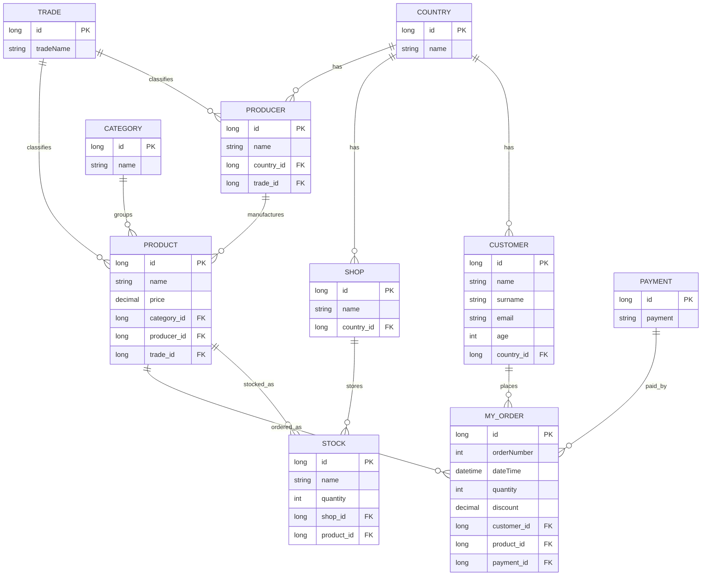
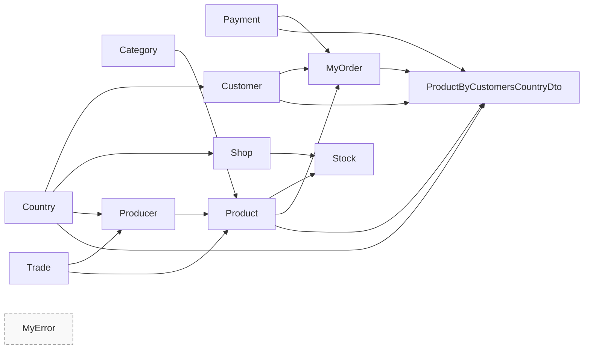

# Domain Dependency Analysis

Date: 2026-06-10  
Source baseline: existing repository domain model + `MODERNIZATION_REPORT.md`

## Scope and assumptions

- This analysis focuses on **domain structure and migration sequencing** only (no Java implementation).
- Primary domain entities come from `src/main/java/jan/stefan/hibernate/model`.
- Reporting model is represented by `src/main/java/jan/stefan/hibernate/dto/modelDto/statModelDto/ProductByCustomersCountryDto`.
- Enums `EGuarantee` and `EPayment` are treated as value/reference types, not standalone JPA tables.

---

## 1) Domain entities identified

## Core JPA entities

- `Category`
- `Country`
- `Customer`
- `Producer`
- `Product`
- `Shop`
- `Stock`
- `Trade`
- `Payment`
- `MyOrder`
- `MyError`

## Reporting entity/model

- `ProductByCustomersCountryDto` (read model / projection DTO)

## Value/reference enums

- `EGuarantee` (used by `Product.guaranteeComponents`)
- `EPayment` (used by `Payment.payment`)

---

## 2) Dependency graph and relationship map

## Relationship inventory (cardinality + dependency direction)

- `Country` 1 -> N `Customer` (child depends on country)
- `Country` 1 -> N `Shop` (child depends on country)
- `Country` 1 -> N `Producer` (child depends on country)
- `Trade` 1 -> N `Producer` (child depends on trade)
- `Category` 1 -> N `Product` (child depends on category)
- `Producer` 1 -> N `Product` (child depends on producer)
- `Trade` 1 -> N `Product` (child depends on trade)
- `Customer` 1 -> N `MyOrder` (order depends on customer)
- `Product` 1 -> N `MyOrder` (order depends on product)
- `Payment` 1 -> N `MyOrder` (order depends on payment)
- `Shop` 1 -> N `Stock` (stock depends on shop)
- `Product` 1 -> N `Stock` (stock depends on product)
- `Product` 1 -> N `EGuarantee` values (element collection)

## Parent/child dependency summary

- **Reference parents**: `Country`, `Trade`, `Category`, `Payment`
- **Master parents**: `Customer`, `Producer`, `Shop`, `Product`
- **Transactional children**: `MyOrder`, `Stock`
- **Operational standalone**: `MyError` (no hard FK dependencies)

## Independent vs dependent entity existence

### Can exist independently

- `Country`
- `Trade`
- `Category`
- `Payment`
- `MyError`

### Require other entities before creation

- `Customer` -> requires `Country`
- `Shop` -> requires `Country`
- `Producer` -> requires `Country` + `Trade`
- `Product` -> requires `Category` + `Producer` + `Trade`
- `Stock` -> requires `Shop` + `Product`
- `MyOrder` -> requires `Customer` + `Product` + `Payment`
- `ProductByCustomersCountryDto` -> requires data from `MyOrder` + `Customer` + `Country` + `Product` (+ optionally `Payment`)

---

## 3) Entity classification

## Root entities

- `Customer`
- `Producer`
- `Product`
- `Shop`

## Reference entities

- `Country`
- `Category`
- `Trade`
- `Payment`
- Value enums: `EGuarantee`, `EPayment`

## Transactional entities

- `MyOrder`
- `Stock`

## Reporting entities

- `ProductByCustomersCountryDto`

## Operational/Audit entities

- `MyError`

---

## 4) Per-entity dependency analysis (dependencies, dependents, difficulty, prerequisites)

| Entity | Dependencies (requires) | Dependents (used by) | Migration Difficulty | Migration Prerequisites |
|---|---|---|---|---|
| `Country` | None | `Customer`, `Shop`, `Producer` | Low | Base JPA config, naming conventions |
| `Category` | None | `Product` | Low | Base JPA config |
| `Trade` | None | `Producer`, `Product` | Low | Base JPA config |
| `Payment` | None (enum-backed) | `MyOrder` | Low | Decide enum strategy (`@Enumerated`) |
| `Customer` | `Country` | `MyOrder` | Medium | `Country` migrated; unique email rule; validation model |
| `Shop` | `Country` | `Stock` | Medium | `Country` migrated; shop naming constraints |
| `Producer` | `Country`, `Trade` | `Product` | Medium | `Country` + `Trade` migrated; uniqueness rules |
| `Product` | `Category`, `Producer`, `Trade`, `EGuarantee` | `Stock`, `MyOrder`, reporting | High | Reference entities + `Producer` migrated; guarantee collection mapping; fetch strategy decisions |
| `Stock` | `Shop`, `Product` | Reporting/analytics consumers | High | `Shop` + `Product` migrated; inventory invariants |
| `MyOrder` | `Customer`, `Product`, `Payment` | Reporting projections and analytics | High | `Customer` + `Product` + `Payment`; transactional boundaries; order-number generation |
| `MyError` | None | Ops/reporting endpoints (optional) | Low | Decide keep vs external logging |
| `ProductByCustomersCountryDto` (reporting) | Data from `MyOrder` + `Customer` + `Country` + `Product` | Reporting API consumers | High | Stable transactional schema + projection/query strategy |

## Notes on hardest entities

- `Product`: central dependency hub connecting catalog, producer, trade, stock, and order flows.
- `MyOrder`: highest transactional coupling and ordering rules.
- `Stock`: depends on two parent aggregates and consistency constraints (quantity lifecycle).

---

## 5) Optimal migration order for Spring Boot 3 (entity-first sequence)

1. `Country`, `Category`, `Trade`, `Payment` (reference foundation)
2. `Customer`, `Shop`, `Producer` (first-level dependents)
3. `Product` (depends on reference + producer)
4. `Stock` (depends on shop + product)
5. `MyOrder` (depends on customer + product + payment)
6. `MyError` (independent; can be migrated anytime, typically early or late)
7. Reporting read models (`ProductByCustomersCountryDto` + reporting queries)

Rationale: this sequence minimizes blocked work and FK churn by moving from low-coupled reference entities to high-coupled transactional entities.

---

## 6) Migration roadmap (phased)

## Phase 1: Reference foundation

- **Entities**: `Country`, `Category`, `Trade`, `Payment`
- **Repositories**: Spring Data repositories for above
- **Services**: CRUD services + validation rules for reference data
- **API endpoints**:
  - `GET/POST/PUT/DELETE /api/v1/countries`
  - `GET/POST/PUT/DELETE /api/v1/categories`
  - `GET/POST/PUT/DELETE /api/v1/trades`
  - `GET /api/v1/payments` (and optional CRUD if table-managed)

## Phase 2: Master entities (level 1)

- **Entities**: `Customer`, `Shop`, `Producer`
- **Repositories**: customer/shop/producer repositories with business-key finders
- **Services**: customer/shop/producer services with reference resolution (`Country`, `Trade`)
- **API endpoints**:
  - `GET/POST/PUT/DELETE /api/v1/customers`
  - `GET/POST/PUT/DELETE /api/v1/shops`
  - `GET/POST/PUT/DELETE /api/v1/producers`

## Phase 3: Product aggregate core

- **Entities**: `Product` (+ enum collection mapping for guarantees)
- **Repositories**: product repository + query methods (by name/category/producer)
- **Services**: product service with dependency checks for `Category`, `Producer`, `Trade`
- **API endpoints**:
  - `GET/POST/PUT/DELETE /api/v1/products`
  - `GET /api/v1/products?category=&producer=&trade=`

## Phase 4: Inventory transactions

- **Entities**: `Stock`
- **Repositories**: stock repository (by shop, by product)
- **Services**: stock service with quantity and integrity rules
- **API endpoints**:
  - `GET/POST/PUT/DELETE /api/v1/stocks`
  - `GET /api/v1/shops/{id}/stocks`
  - `GET /api/v1/products/{id}/stocks`

## Phase 5: Order transactions

- **Entities**: `MyOrder`
- **Repositories**: order repository (by order number/date/customer)
- **Services**: order service with transactional workflows and number generation
- **API endpoints**:
  - `GET/POST/PUT/DELETE /api/v1/orders`
  - `GET /api/v1/orders/{orderNumber}`

## Phase 6: Reporting + optional operational audit

- **Entities**: reporting projections (`ProductByCustomersCountryDto`), optional `MyError`
- **Repositories**: projection/report queries
- **Services**: reporting service and optional error/audit service
- **API endpoints**:
  - `GET /api/v1/reports/products-by-country`
  - `GET /api/v1/reports/most-expensive-by-category`
  - Optional: `GET /api/v1/errors`

---

## 7) Mermaid ER diagram

## Mermaid dependency diagram (entity dependency flow)

---

## Safety-first implementation guidance

- Keep migrations **dependency-layered**: reference -> master -> transactional -> reporting.
- Add DB constraints (FK + unique business keys) as soon as each layer is introduced.
- Do not build reporting endpoints until transactional entities (`Product`, `MyOrder`, `Stock`) and their repositories are stable.
- Treat `Product` and `MyOrder` as the highest-risk migration points and gate them with focused integration tests before moving to reporting.

